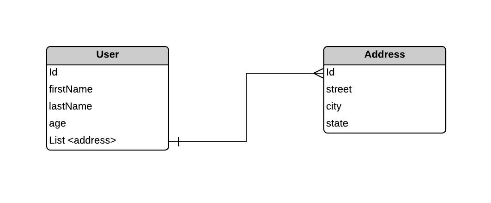

# MONGODB ATLAS CRUD IN ACTION

:star: If you find it educational, please consider star me on github


[MongoDB](https://www.mongodb.com/products/platform/atlas-database) Atlas is a fully-managed cloud database that handles all the complexity of deploying, managing, and healing your deployments on the cloud service provider of your choice (AWS , Azure, and GCP). MongoDB Atlas is the best way to deploy, run, and scale MongoDB in the cloud.


## Table of Contents
- [Pre-requisite](#prerequisite)
- [Installation](#installation)


## Pre-requisite 

 In order to run the spring boot application, you'll need the following installed to your computer.

- (Important) MongoDB Atlas Account
- JAVA JDK - open jdk 17 or above
- Knowledge in Object Oriented Programming
- (Optional) : [IntelliJ IDEA Conmmunity Edition](https://www.jetbrains.com/idea/)


## Installation

### Setup MongoDB Atlas Account
- Before you even started running the application, we need to setup first the MongoDB Atlas account (it's free so don't worry :smile:)
- After creating the account, click the cluster to see the connection option 
- on the ``Set up connection security `` section, You'll find connect to your application section, click the ``drivers `` and choose ``java``
- There will be a connection string generated if you have successfully created a cluster in MongoDB, it wil look something like this
  - ``mongodb+srv://joshua:<password>@cluster0.zpxjoyi.mongodb.net/?retryWrites=true&w=majority&appName=Cluster0``
- save the connection string for later.

### Run the Application through IntelliJ Idea (Recommended but Optional) <span style="color:green;" class="task-list-item-icon">✔</span>

<b>Note</b>: If you want to run the Application quickly, it is recommended that you install IntelliJ Idea which can be found in the Pre-requisite section

- Clone the project
- Open the project through IntelliJ
- right click the ``MongodbImmersionCrudApplication`` and Modify run configuration
- under build and run configurations, you'll see that you don't have jdk yet (if you don't have java jdk on the machine), click and fine the correto-17jdk 
- finally on the terminal run ``maven clean:install`` or just use the IDE to build and run the project


### Logical Data Model

This section contains sample LDM for the MongoDB App



In this simple ERD, the following rules are set:

Relationship
- User has basic information
- User can have many addresses


### Endpoints

The following endpoints is set

## Address API

#### Get All Address

##### [GET] [http://localhost:8080/api/addresses]


#### Description
Get All Addresses Collection document

#### Request Headers
| Header         | Value            | Description                 |
|----------------|------------------|-----------------------------|
| Content-Type   | application/json | Type of content being sent  |

#### Request Parameters
| Parameter      | Type     | Required | Description                 |
|----------------|----------|----------|-----------------------------|

#### Sample Request Body
N/A

##### Sample Success Response
**Code:** 200 OK
**Content:**
```json
[{
    "id": "664f4acbe1a1a124b928d0f5",
    "street": "test",
    "city": "Las Pinas",
    "state": "Philippines"
},
{
    "id": "664f4e6f3fa0ea431721f15c",
    "street": "123 Main St",
    "city": "Springfield",
    "state": "IL"
}]
```


#### Add Address

[POST] [http://localhost:8080/api/address]


#### Description
Add Address into the Collection

#### Request Headers
| Header         | Value            | Description                 |
|----------------|------------------|-----------------------------|
| Content-Type   | application/json | Type of content being sent  |

#### Request Parameters
| Parameter      | Type     | Required | Description                 |
|----------------|----------|----------|-----------------------------|
| street         | string   | No       | Address Street              |
| city           | string   | No       | Address City                |
| state          | string   | No       | Address Country             |
| zipcode        | string   | No       | Address ZipCode             |

#### Sample Request Body
```json
{
           "street": "baka",
           "city": "Makati",
           "state": "Philippines",
           "zipCode": "1683"
}
```

##### Sample Success Response
**Code:** 200 OK
**Content:**
```json
{
           "street": "baka",
           "city": "Makati",
           "state": "Philippines",
           "zipCode": "1683"
}
```
#### Update Address

[PUT] [http://localhost:8080/api/address/{id}]

#### Description
Update Address into the Collection

#### Request Headers
| Header         | Value            | Description                 |
|----------------|------------------|-----------------------------|
| Content-Type   | application/json | Type of content being sent  |

#### Request Parameters
N/A

#### Sample Request Body
```json
{
           "street": "baka",
           "city": "Makati",
           "state": "Philippines",
           "zipCode": "1683"
}
```
##### Sample Success Response
**Code:** 200 OK
**Content:**
```json
{
           "street": "baka",
           "city": "Makati",
           "state": "Philippines",
           "zipCode": "1683"
}
```

## User API

#### Get All Users with Address

[GET] [http://localhost:8080/api/users]

#### Description
Get all Users with Address in the collection

#### Request Headers
| Header         | Value            | Description                 |
|----------------|------------------|-----------------------------|
| Content-Type   | application/json | Type of content being sent  |

#### Request Parameters
N/A

#### Sample Request Body
N/A

##### Sample Success Response
**Code:** 200 OK
**Content:**
```json
[
  {
    "id": "664f4acbe1a1a124b928d0f6",
    "firstName": "Joshua",
    "lastName": "De Guzman",
    "age": 25,
    "addresses": [
      {
        "id": "664f4e6f3fa0ea431721f15c",
        "street": "123 Main St",
        "city": "Springfield",
        "state": "IL"
      }
    ]
  }
]
```

#### Add User with Addresses

[POST] [http://localhost:8080/api/user]

#### Description
Add User with  Address into the Collection

#### Request Headers
| Header         | Value            | Description                 |
|----------------|------------------|-----------------------------|
| Content-Type   | application/json | Type of content being sent  |

#### Request Parameters
| Parameter | Type          | Required | Description                                                |
|-----------|---------------|----------|------------------------------------------------------------|
| firstName | string        | No       | user first name                                            |
| lastName  | string        | No       | user last name                                             |
| age       | integer       | No       | user age                                                   |
| addresses | List<Address> | No       | Address JSON Data, see address params for more information |


#### Sample Request Body
```json
{
    "firstName":"KJ",
    "lastName": "Leb",
    "age": 25,
    "addresses": [
        {
            "street": "test",
            "city": "Las Pinas",
            "state": "Philippines"
        }
    ]
}
```

#### Sample Request Response
```json
{
    "id": "6654566520253a7ec54f0a09",
    "firstName": "KJ",
    "lastName": "Leb",
    "age": 25,
    "addresses": [
        {
            "id": "6654566520253a7ec54f0a08",
            "street": "test",
            "city": "Las Pinas",
            "state": "Philippines"
        }
    ]
}
```

#### Update User with Addresses

[PUT] [http://localhost:8080/{id}]

#### Description
Add User with  Address into the Collection

#### Request Headers
| Header         | Value            | Description                 |
|----------------|------------------|-----------------------------|
| Content-Type   | application/json | Type of content being sent  |

#### Request Parameters
| Parameter | Type          | Required | Description                                                |
|-----------|---------------|----------|------------------------------------------------------------|
| firstName | string        | No       | user first name                                            |
| lastName  | string        | No       | user last name                                             |
| age       | integer       | No       | user age                                                   |
| addresses | List<Address> | No       | Address JSON Data, see address params for more information |


#### Sample Request Body
```json
{
    "firstName":"KJ",
    "lastName": "Leb",
    "age": 25,
    "addresses": [
        {
            "street": "test",
            "city": "Las Pinas",
            "state": "Philippines"
        }
    ]
}
```

#### Sample Request Response
```json
{
    "id": "6654566520253a7ec54f0a09",
    "firstName": "KJ",
    "lastName": "Leb",
    "age": 25,
    "addresses": [
        {
            "id": "6654566520253a7ec54f0a08",
            "street": "test",
            "city": "Las Pinas",
            "state": "Philippines"
        }
    ]
}
```


### Enhancements and Improvements 

 Since this is a simple demo project, You can further extend and customize this app crud project if you want to learn more about spring boot, some enhancements and improvements that you can implement are:

- Request Validation - for not nullable collection 
- Proper Response logging for the success response (200 response code)
- Multi-nested document collection - Create a schema where there's a nth level to appreciate the performance of the MongoDB